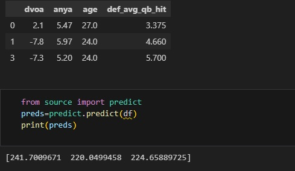

## Goals
- The goal for this project is to create a prediction model that can predict a NFL quarterbacks total passing yards
- If succesful, this can be used for coaching/analytics, as part of a full game model, or simply to bet QB player props

## Challenges 
- Anything we use as a predictor must be known before the game starts, so we cannot use box scores from the game we are predicting
- some stats have multicolinearity ( pass completions and number of touchdowns scored for example)
- Many of the advance stats were only available for the current season, and some of them even keep their formula secret

## Conclusion
- The results were a bit dissapointing so far, as the best model was only able to reduce MAE to around 57 yards
- This means that on average the prediction will be +/- 57 yards on a 270 average which is pretty bad
- A basic linear regression model outperformed more advanced machine learning models like XGBoost and RFC, even when tuning with gridsearch
- Interceptions appear to be truly random, as a seperate binary classifier model was unable to get above 51% accuracy
- It seems like one player can under/overperform to a greater extent than 50 people can, leading to higher volatility

## Future Goals

- It may be necessary to model every player individually, right now I am only using stats for the quarterback and then the defending team as a whole
- It may also be necessary to adjust for pace of play.  Some teams play faster than others, leading to more or less snaps per game for them and the opposition

# File Layout

## Data Folder
#### I saved data I was re-using alot, in 4 stages of processing
- pbp_data.csv - Contains every snap from 2016-2023
- game_data.csv - Same data as pbp_data but grouped into games, instead of snaps
- current_qb.csv - The game data after filtering for only currently active QBs and with some aggregate features added
- qb_data_advanced.csv - stats for active QBs with more advanced stats added

## Experiments Folder
- contains jupyter notebooks of data cleaning and processing
- contains previous iterations of the model

## Source Folder

- __final model.ipynb__ - Notebook creating the final model.  Feature selection and engineering was done in the process of the previous models, and the best was kept

- __final_model.sav__ - a pickled save of the final model, used by app.py and predict.py to make predictions

- __data.py__ - contains a function get_data which takes a list of years and returns a dataframe of Games and Quarterback stats for those games.

- __app.py__ - Flask app, if you run this you can access a basic web page which will ask for input and give you a prediction

- __predict.py__ - contains the function predict, which takes a dataframe or array and returns the predicted passing yards given by the most recent model
- The input dataframe columns must be in this order:  Offense DVOA, QB ANY/A, QB Age, Defending Teams AVG QB Hits
- An example is below

